# Elixir Dev

Test-driven development workflow for Elixir projects. Break work into tasks, write tests first, implement properly, verify, commit per task.

**Rigid skill. Follow exactly. No shortcuts.**

## Before Starting

If the project has a code style guide or dev conventions doc, read it fresh every time.

## Step 0: Break Down into Tasks

Decompose the work into small, independently testable and committable tasks. Each task should represent one logical unit of work (one function, one module, one behavior change).

Use `TaskCreate` for each task with:
- **subject**: imperative form (e.g., "Add tenant key validation to Store")
- **description**: what needs to be done, acceptance criteria
- **activeForm**: present continuous (e.g., "Adding tenant key validation")

Set dependencies with `TaskUpdate` if tasks must be done in order.

**Gate:** All tasks created and ordered before writing any code.

## Per-Task Loop

For each task (in dependency order):

1. `TaskUpdate` — mark task `in_progress`
2. Run through the phases (RED → GREEN → iex → UI check if applicable)
3. Commit the task's changes
4. `TaskUpdate` — mark task `completed`
5. `TaskList` — pick the next unblocked task

```dot
digraph dev {
    rankdir=TB;

    subgraph cluster_setup {
        label="Setup";
        style=dashed;
        read [label="Read project\nconventions", shape=box];
        breakdown [label="Break down\ninto tasks\n(TaskCreate)", shape=box];
        read -> breakdown;
    }

    subgraph cluster_loop {
        label="Per-Task Loop";
        style=bold;

        start_task [label="Start task\n(TaskUpdate\nin_progress)", shape=box, style=filled, fillcolor="#e6e6e6"];
        red [label="RED\nWrite failing test", shape=box, style=filled, fillcolor="#ffcccc"];
        verify_red [label="Fails\ncorrectly?", shape=diamond];
        green [label="GREEN\nImplement", shape=box, style=filled, fillcolor="#ccffcc"];
        verify_green [label="All\ngreen?", shape=diamond];
        iex [label="iex\nVerify in shell", shape=box, style=filled, fillcolor="#ffffcc"];
        verify_iex [label="Results\nexpected?", shape=diamond];
        ui_changed [label="UI\nchanged?", shape=diamond];
        ui_check [label="UI CHECK\nVisual verify", shape=box, style=filled, fillcolor="#ccccff"];
        commit [label="COMMIT\ngit add + commit", shape=box, style=filled, fillcolor="#d4edda"];
        complete_task [label="Complete task\n(TaskUpdate\ncompleted)", shape=box, style=filled, fillcolor="#e6e6e6"];

        more_tests [label="More test\ncases?", shape=diamond];
        final_test [label="FINAL TEST\nmix test\n(full suite)", shape=box, style=filled, fillcolor="#fff0cc"];

        start_task -> red;
        red -> verify_red;
        verify_red -> green [label="yes"];
        verify_red -> red [label="fix test"];
        green -> verify_green;
        verify_green -> more_tests [label="yes"];
        verify_green -> green [label="fix code"];
        more_tests -> red [label="yes\nnext test block"];
        more_tests -> final_test [label="no"];
        final_test -> iex;
        iex -> verify_iex;
        verify_iex -> ui_changed [label="yes"];
        verify_iex -> green [label="no, fix code"];
        ui_changed -> ui_check [label="yes"];
        ui_changed -> commit [label="no"];
        ui_check -> commit;
        commit -> complete_task;
    }

    subgraph cluster_finish {
        label="After All Tasks";
        style=dashed;
        precommit [label="PRECOMMIT\nmix precommit", shape=box, style=filled, fillcolor="#ffd9b3"];
        qa [label="QA\n/qa", shape=box, style=filled, fillcolor="#e6ccff"];
        review [label="REVIEW\n/review", shape=box];
        retro [label="RETROSPECTIVE\ndocs/retrospectives/", shape=doublecircle];
        precommit -> qa;
        qa -> review;
        review -> retro;
    }

    breakdown -> start_task;
    complete_task -> start_task [label="next task", style=dashed];
    complete_task -> precommit [label="all done"];
}
```



### Phase 1: RED — Write Failing Test

Write **one `test` block** — not the whole test module. Follow `/elixir-test` for test structure and conventions.

Run the test by line number:
```bash
mix test test/path/to/module_test.exs:LINE --max-failures 1 --no-all-warnings
```

**Gate:** Test fails for the expected reason (feature missing, not a typo or compilation error).

Test passes immediately? You're testing existing behavior. Fix the test.

### Phase 2: GREEN — Implement

Write production-quality code that makes the test pass.

**Requirements:**
- `@spec` on every public function — use the most specific types available
- Propagate errors as `{:ok, _}` / `{:error, _}` — don't raise, don't rescue to swallow
- Follow the project's code style and conventions
- No unnecessary comments — if a better function name or typespec makes the comment redundant, delete the comment

Run affected tests:
```bash
mix test --stale --max-failures 1 --no-all-warnings
```

If retrying after a fix:
```bash
mix test --failed --no-all-warnings
```

**Gate:** All affected tests pass.

Tests fail? Fix the code, not the test.

**Then repeat RED → GREEN** for the next `test` block until all test cases for the task are written and passing.

### Phase 3: iex — Verify in Shell

Start an interactive session:
```bash
iex -S mix
```

Call the new/changed public functions with realistic arguments. Verify return values match expectations.

**Gate:** Functions behave as expected with realistic inputs.

Something's off? Go back to phase 2.

### Phase 4: UI Check (if UI changed)

**Only if templates, LiveView, or frontend code changed.**

Navigate to the relevant page and verify the UI reflects the changes.

**Gate:** Visual and interactive behavior matches expectations.

### Phase 5: Final Test Run

Before committing, run the full test suite with all warnings visible:
```bash
mix test
```

This catches warnings that `--no-all-warnings` suppressed earlier.

**Gate:** Full suite green, no warnings.

### Phase 6: COMMIT — Lock in the Task

After all gates pass for the current task, commit the changes:

1. Stage only the files related to this task (no `git add -A`)
2. Write a concise commit message focused on the "why"
3. Commit

**Gate:** Commit succeeds. `git status` shows a clean state for the task's files.

Do NOT batch multiple tasks into one commit. Each task = one commit.

### After All Tasks

#### Precommit

Run the full precommit suite:

```bash
mix precommit
```

Fix any failures before proceeding.

**Gate:** `mix precommit` passes clean.

#### QA

Run `/qa` to verify the feature through iex scenarios and optionally through the browser.

**Gate:** All QA scenarios pass.

#### Review

Run `/review` on the full set of changes.

#### Retrospective

Run `/retrospective` to capture what happened, what was learned, and process improvements.

**Gate:** Retrospective written and committed.

## Red Flags — STOP

- Writing code before the test
- Writing all test cases at once instead of one `test` block per RED-GREEN cycle
- Test passes on first run
- Skipping iex because "the tests cover it"
- Adding comments that restate the code
- Using `String.t()` when a more specific type exists
- Raising exceptions in domain code
- Committing multiple tasks in one commit
- Marking a task completed before all gates pass
- Writing code before creating tasks
- Skipping the final `mix test` (full suite, with warnings) before committing

## Quick Reference

```
0. Tasks    Decompose work → TaskCreate per unit → set dependencies
── Per task ──────────────────────────────────────────────────────
1. Start    TaskUpdate in_progress
── Per test case (repeat 2-3 for each test block) ───────────────
2. RED      Write ONE test block → mix test path:LINE --max-failures 1 --no-all-warnings → fails correctly
3. GREEN    Implement → mix test --stale --max-failures 1 --no-all-warnings → green
            Retry: mix test --failed --no-all-warnings
── After all test cases for the task ────────────────────────────
4. FINAL    mix test → full suite, all warnings visible → fix any warnings
5. iex      iex -S mix → call public functions → results look right
6. UI       If UI changed → visual check
7. COMMIT   git add specific files → git commit → clean state
8. Done     TaskUpdate completed → TaskList → next task
── After all tasks ───────────────────────────────────────────────
9.  Precommit  mix precommit → fix any failures
10. QA         /qa → iex scenarios + browser flows (if applicable)
11. Review     /review
12. Retro      Write docs/retrospectives/<YYYYMMDD_HHMMSS>_<slug>.md → commit
```
